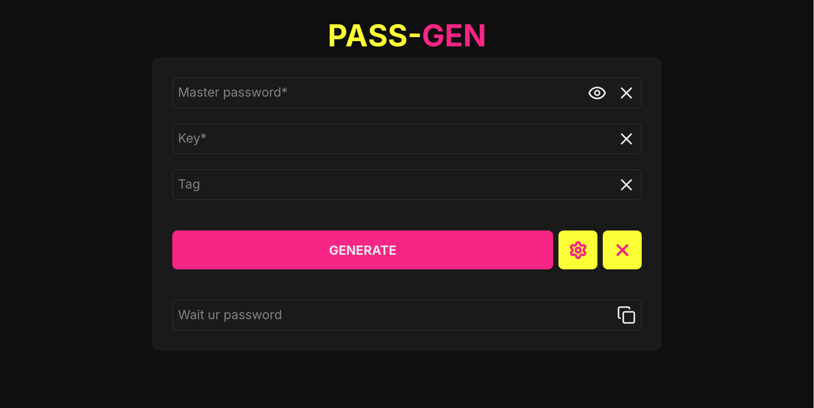
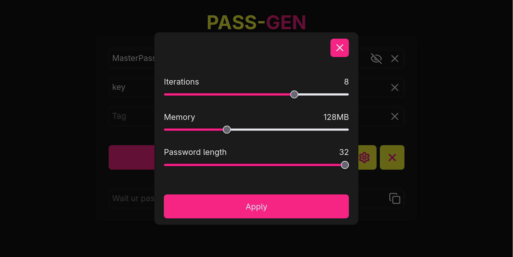

# Password Generator

A stateless password generator that derives unique, reproducible passwords from a **master password**, **key**, and optional **tag**.

## Features

* Deterministic password generation
* Argon2-based derivation
* Fully client-side
* Customizable generation settings (Iterations, Memory, Password length)

---

## Usage

1. Enter your **master password**
2. Enter a **key**
3. (Optional) add a **tag**
4. (Optional) adjust **generation settings**
5. Click **Generate**

---

## Security

* Nothing is stored or sent anywhere
* All computations happen locally
* Security depends on your master password

---

## Tech

React • TypeScript • Vite • Tailwind • Argon2

---

## Screenshots

### Main Interface

### Generated password

### Generation Settings

